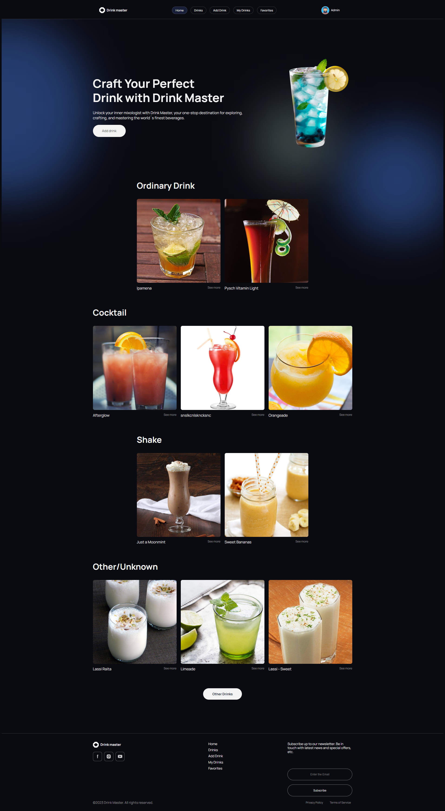

# Командний проєкт

Метою роботи команди було створення застосунку про виготовленя власних коктейлів. 
Коктейль - напій, що отримується змішуванням кількох компонентів. Найчастіше коктейлі є або комбінацією спиртних напоїв, або безкорисною дитячою сумішшю. 
Коктейлі сильно різняться в різних регіонах світу, тому наш проект покликаний для публікації як оригінальних рецептів, так і власних інтерпретацій старих і відомих коктейлів.

## Моя участь у роботі команди

Мені було доручено та мною реалізована авторизація користувачів та
уся пов'язана з цим логіка

## Команда

Хочу висловити щиру подяку кожному хто приймав участь у проєкті. 
Це був корисний та важливий досвід спільної роботи.

## Frontend:

## Backend:
https://drink-master-server.onrender.com/api-docs/  

---

### Thank you for watching!
